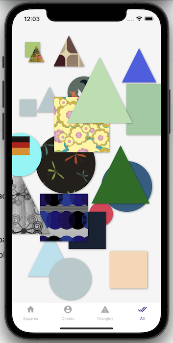
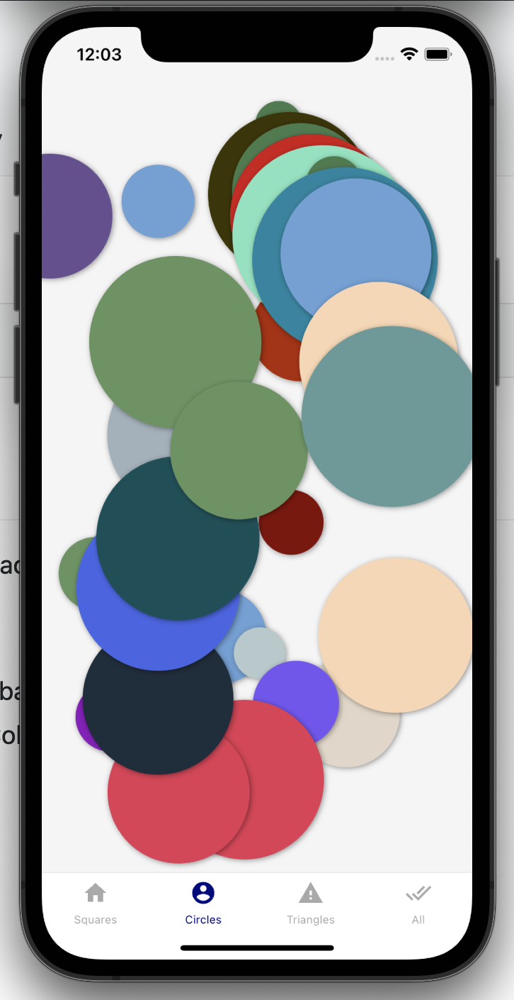

# React Native Spawn Shapes
Gesture & animation based application using React Native 0.64.2, React 17.0.1, react-native-gesture-handler & react-native-fast-image

This app runs on React Native v0.64.2, React v17.0.1 with features:<br />
* Tap on background to generate shapes: Square, Circle, Triangle based on bottom tab
* Generated shapes with either have random color or pattern by ColourLovers API
* If API fail, shapes will be filled with random color
* Enter & exit animation added
* Pan or drag the shapes around
* Shake device to clear all shapes

<br />Screenshots<br /><br />

<br /><br />

Try it out at<br />
https://i.diawi.com/TpHuV1

or<br />
https://drive.google.com/file/d/1c0XLHX0phz7xtOrlNi0tovoG2hYooVwK/view?usp=sharing

Setup project:
```
git clone https://github.com/datvp09/RNSpawnShapes.git

cd RNSpawnShapes && npm install

npx pod-install
```
Make sure SDK Enviroment is setup properly and run:
```
react-native run-android/ios
```
